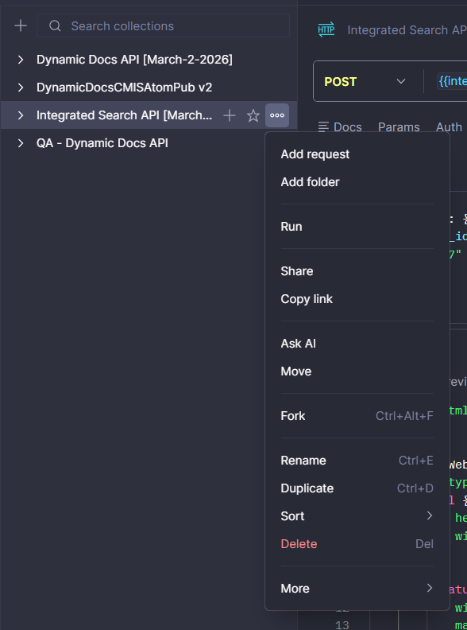

## **Integrated Searches Guide**

| | |
|---|---|
| **Repository** | [Archeio/DynamicDocs_IntegratedSearches](https://github.com/Archeio/DynamicDocs_IntegratedSearches) |
| **Version** | v1.0 |
| **Status** | Draft |
| **Last Reviewed** | March 2, 2026 |
| **Reviewed By** | Diego Jacome |
| **Audience** | QA Team |
| **Environment** | Test |

---

### Table of Contents

- [**Integrated Searches Guide**](#integrated-searches-guide)
  - [Table of Contents](#table-of-contents)
  - [**Introduction**](#introduction)
  - [Integrated Search API](#integrated-search-api)
    - [Search Endpoint](#search-endpoint)
    - [Full Request Body Example](#full-request-body-example)
  - [**Nested objects**](#nested-objects)

---

### **Introduction**

This repository implements an advanced API for searching and filtering enterprise/document data stored in Elasticsearch, enabling complex and aggregated queries, and also provides a Flink-based data processing pipeline.
The main project is a system for performing advanced searches over document, location, and project data stored in Elasticsearch.

The core of the system is a service called "Search Service," implemented as a .NET 8 Web API. It exposes a **/api/search** endpoint that allows for complex, faceted queries using nested filters over indexed data.
The service is designed to be extensible, modular, and efficient, allowing for cross-index attribute resolution and aggregated queries in Elasticsearch.
Internally, it is divided into layers (API, Application, Infrastructure) and modules focused on handling different search domains (documents, locations, and projects).

### Integrated Search API

#### Search Endpoint

This endpoint allows the web app to communicate with Elastic Search:
https://test-api.ondemandquorum.com/search/v1/api/Search


#### Full Request Body Example

<details>
<summary>Click to expand full request body</summary>

```json
{
  "document": {
    "content_id": [
      "string"
    ],
    "contentIdFrom": "string",
    "contentIdTo": "string",
    "contentQuery": "string",
    "openFilterSearch": "string",
    "contentVersion": "string",
    "docName": "string",
    "processingStatus": "Unprocessed",
    "minOCRConfidence": 0,
    "maxOCRConfidence": 0,
    "isLocked": true,
    "isContentActive": true,
    "isTemplateActive": true,
    "isCurrent": true,
    "creationDateFrom": "string",
    "creationDateTo": "string",
    "lastModificationDateFrom": "string",
    "lastModificationDateTo": "string",
    "minFileSize": 0,
    "maxFileSize": 0,
    "extension": "string",
    "template": {
      "templateId": "string",
      "name": "string"
    },
    "hashtags": [
      "string"
    ],
    "comments": [
      {
        "userId": "string",
        "comment": "string"
      }
    ],
    "primaryLocationId": "string",
    "secondaryLocationId": "string",
    "tertiaryLocationId": "string",
    "linkedTo": [
      {
        "tertiaryId": "string",
        "name": "string"
      }
    ],
    "attributes": [
      {
        "attributeId": "string",
        "name": "string",
        "attributeTypeId": "AlphaNumeric",
        "value": "string",
        "dateValue": "string",
        "dateFrom": "string",
        "dateTo": "string",
        "numberFrom": "string",
        "numberTo": "string"
      }
    ],
    "packetIds": [
      "string"
    ]
  },
  "location": {
    "locationId": "string",
    "locationType": "string",
    "parentId": "string",
    "name": "string",
    "properties": [
      {
        "attributeId": "string",
        "name": "string",
        "attributeTypeId": "AlphaNumeric",
        "value": "string",
        "dateValue": "string",
        "dateFrom": "string",
        "dateTo": "string",
        "numberFrom": "string",
        "numberTo": "string"
      }
    ]
  },
  "packet": {
    "projectId": "string",
    "name": "string",
    "packetEntities": [
      {
        "attributeId": "string",
        "name": "string",
        "attributeTypeId": "AlphaNumeric",
        "value": "string",
        "dateValue": "string",
        "dateFrom": "string",
        "dateTo": "string",
        "numberFrom": "string",
        "numberTo": "string"
      }
    ]
  },
  "softDeletedFilter": "ExcludeDeleted",
  "pageNumber": 0,
  "pageSize": 0,
  "searchType": "Regular",
  "sort": {
    "field": "string",
    "order": "string",
    "attributeId": 0,
    "attributeTypeId": "AlphaNumeric"
  }
}
```

</details>

### **Nested objects**


Elasticsearch mapping

The following are nested objects in the mapping:

- attribute_values (with attribute_id, date_value, value)
- comments (with comment, user_id)
- hashtags (with name)
- linked_to (with name, tertiary_id)

In Elasticsearch, the nested data type is used to index arrays of objects so that each object within the array remains isolated for searches and aggregations. This prevents cross-matching that occurs with the standard object type when there are multiple objects within the same array.

**What is nested and why does it exist?**

Problem with object (default): If you have a field that is an array of objects, Elasticsearch “flattens” the values and, in queries, can combine fields from different elements in the array to satisfy conditions, resulting in false positives.

Solution with nested: Each element of the array is indexed as an internal document linked to the main document. Queries must specify the path of the nested field, and conditions are evaluated per element, without mixing fields from different elements.

In practical terms: Use nested when you need the conditions of a query to be met within the same object in the array.
